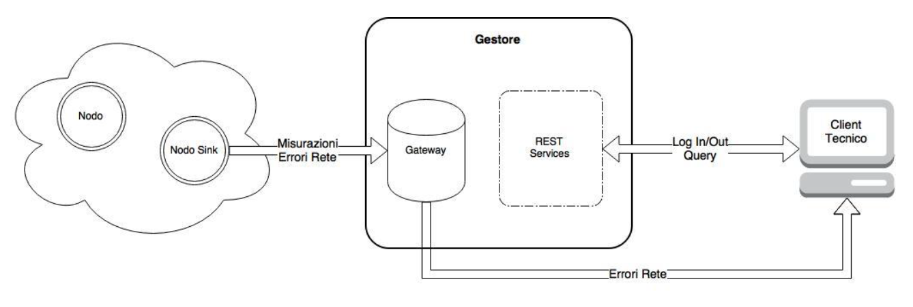

Questo progetto universitario è stato realizzato per il corso Sistemi Distribuiti e Pervasivi.
Il suo scopo è quello di realizzare un sistema di monitoraggio remoto di un ambiente sensorizzato simulato come nell'illustrazione.

Nel file [Definizione Progetto.pdf](Doc/Definizione_Progetto.pdf) è definito come i vari componenti interagiscono tra di loro.

Per far partire la simulazione compilare separatamente i due progetti java SDPNode e SDPTechnician nei corrispondenti .jar.
Far partire il server REST situato in SDPManager (su Eclipse selezionare il progetto -> Run -> Run As -> Run on Server).
Eseguire il file [SDP_Sensors_Network.bat](Sorgenti/SDP_Sensors_Network.bat) per inizializzare i sensori e far partire la simulazione.
Ora è possibile formulare query attraverso SDPTechnician.jar precedentemente compilato.

Tutti i progetti sono stati creati e testati in Eclipse.

Sviluppato nel 2016 da:
Alessandro De Francesco
